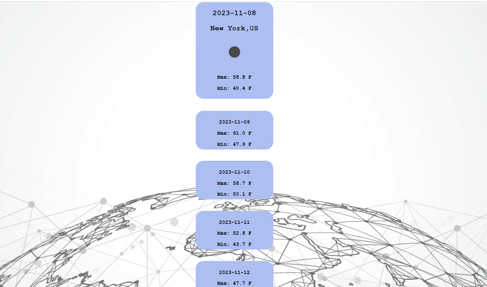
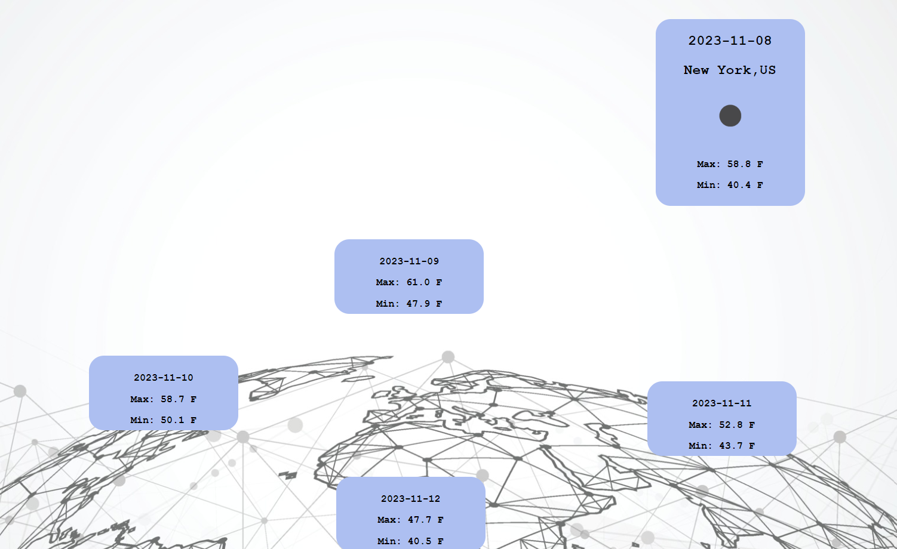
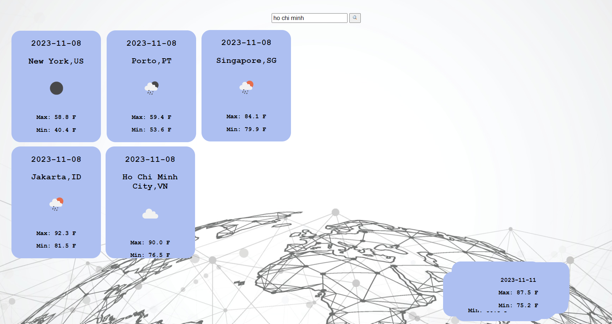

# Phase-1-Project-5Day-Forecast

# 5-Day-Temperature-Forecast
 5-Day-Temeprature-Forecast is a web application that will return the next 5 days maximum and minimum temeprature data of a city.

# Installation

No installations required.

# Usage

User should enter the city for which they want to check the weather in the input field.  Submit the entry by clicking the search button or by pressing the "enter" key.

  
Application will return 5 containers, displaying the maximum and minimum temeprature of the city for the next 5 days.

Application has a drag and move feature which will allow the user to drag and reposition each container element along the browser window. 

Previous results will not dissapear, allowing the user to continue adding further entries to teh browser window.

